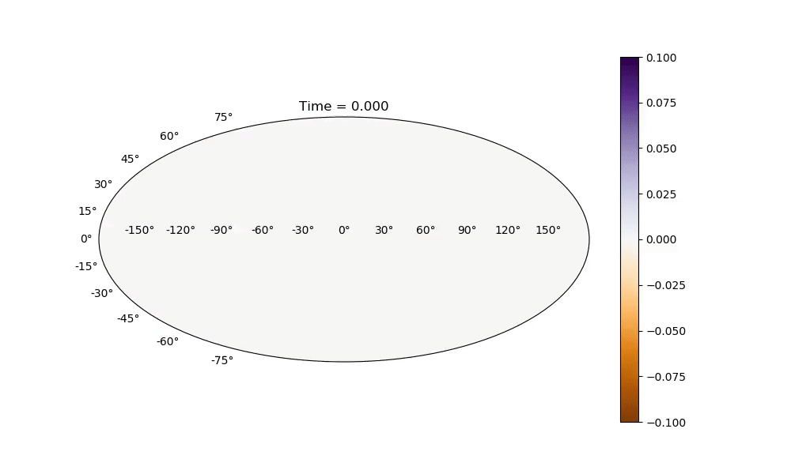

## Description

A code that calculates the time-dependent motion of tides on a water planet according to the [Laplace Tidal Equations](https://farside.ph.utexas.edu/teaching/336L/Fluid/node170.html).

This project was created in the context of the [2019 McGill Physics Hackathon](https://mcgill-physics-hackathon-2019.devpost.com/), and was awarded the Astro Prize at the end of a grueling yet fun 25 hours of coding.  We plan on improving our code in the future.

Our presentation can be found [here](https://docs.google.com/presentation/d/1e4v-OOaLhNhDVOC3KVcAQqDPKq7CV9Q904R-i-lJ_3E/edit?usp=sharing).

# The team
[Mathieu Bergeron](https://github.com/fasttachyon) - MSc. student at Université de Sherbrooke
[Oscar Céspedes](https://github.com/oscar-CV) - MSc. student at Polytechnique Montréal
[Simon Guichandut](https://github.com/simonguichandut) - MSc. student at McGill University
[Gabriel Laberge](https://github.com/gablabc) - MSc. student at Polytechnique Montréal

## How-to

    python main.py

Use ffmpeg or other software of choice to make movies from the saved frames in the .png folder

## Example results

Static planet and static moon

Static planet and rotating moon

